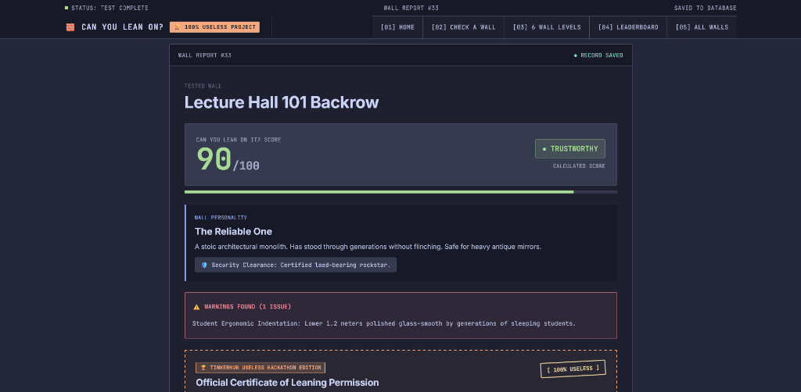
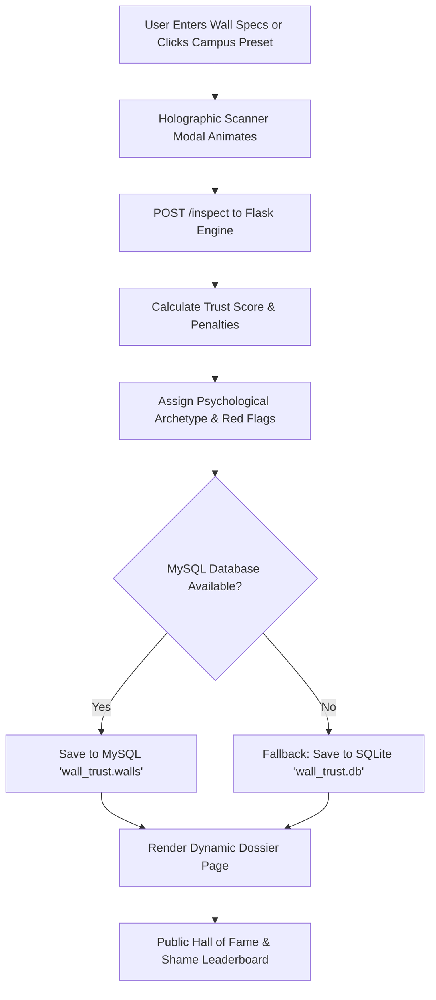

# CAN YOU LEAN ON? 🎯

> *"We all need some wall to lean on."*

## Basic Details
### Team Name: Solo Project

### Team Members
- Team Lead: Kashinath P K - [Your College Name]

### Project Description
A satirical, Apple-grade architectural telemetry platform that answers humanity's most pressing unanswered question: **"Can you lean on this wall without it collapsing or ruining your shirt with chalk powder?"** Features a proprietary 0–100 Trust Score algorithm, psychiatric wall profiling, red flag audits, and a 6-level visual scale ranging from pristine museum concrete to ancient weeping moss bogs.

### The Problem (that doesn't exist)
Millions of tired college students, waiting tea-drinkers, and weary homeowners lean against walls every single day with blind, reckless faith. They have no idea if that wall is secretly plotting structural mutiny, weeping emotional moisture, or coated in decades of chalk dust and peeling paint. The tragic result? Ruined black hoodies, chalk dust embarrassments, and profound architectural trust issues.

### The Solution (that nobody asked for)
**CAN YOU LEAN ON?** provides comprehensive fictional integrity forensics. Users input wall height, millimeter girth, visible existential cracks, and weeping moisture levels. Our algorithm cross-examines the wall's loyalty, classifies it into psychological archetypes (e.g., *Nap Polish Certified*, *The Emotional Sponge*, *The Walking Disaster*), highlights tactical red flags, records the audit to a MySQL database with automatic SQLite fallback, and ranks it on the public Wall Hall of Fame & Shame.

---

## Technical Details
### Technologies/Components Used
For Software:
- **Languages used:** Python 3.11, JavaScript (ES6+), HTML5, Vanilla CSS3
- **Frameworks used:** Flask (Python Web Framework)
- **Libraries used:** `mysql-connector-python` (MySQL Database Driver), `sqlite3` (Zero-Config Automatic Failover)
- **Tools used:** Git & GitHub, VS Code, Antigravity IDE, MySQL Server 8.0, Playwright / Browser Testing

For Hardware:
- *Software Only Project (No hardware components required)*

---

### Implementation
For Software:

# Installation
```bash
# 1. Clone the repository
git clone https://github.com/Kashinathpk001/wall-project.git
cd wall-project

# 2. Set up virtual environment
python -m venv venv
.\venv\Scripts\activate      # Windows (pwsh / cmd)
# source venv/bin/activate  # macOS / Linux

# 3. Install dependencies
pip install -r requirements.txt
```

# Run
```bash
# Start the Flask development server
python app.py

# Open your browser and navigate to:
# http://127.0.0.1:5000/
```
*(Note: If MySQL is not installed or unreachable, the application automatically activates an embedded SQLite fallback database `wall_trust.db` with zero configuration required!)*

---

### Project Documentation
For Software:

# Screenshots

### 1. Interactive Workbench & Live Telemetry

*Real-time wall parameter console with Kerala campus presets, dynamic chalk risk calculations, posture selection, and the interactive Test-Lean Simulator.*

### 2. The 6 Levels of Wall Health (Visual Tier List)

*Photorealistic visual reference guide ranked from Level 06 (The Dream Wall - 100/100) down to Level 01 (Ancient Wet Moss Wall - 02/100 Biohazard).*

### 3. Certified Wall Report & Leaning Permission Dossier

*Detailed wall inspection dossier with calculated trust score (90/100 TRUSTWORTHY), psychological archetype diagnosis ("The Reliable One"), structural warnings, and official certificate of leaning permission.*

### 4. Hall of Fame: Wall Trust Leaderboard

*Live global rankings of campus walls audited by students, tracking the most reliable architectural monoliths and dangerous cardboard partitions.*

---

# Diagrams

### Architecture & Telemetry Workflow

*End-to-end data flow: From user wall parameter inputs, penalty math calculation, dual-database fault-tolerant storage, to live leaderboard ranking.*

---

### Project Demo
# Video
[Add your demo video link here]
*Demonstrates the pitch-black Apple opening animation, testing the Lecture Hall 101 wall, holographic scanning, and inspecting the 6 Levels of Wall Health.*

# Additional Demos
- **Live Local URL:** `http://127.0.0.1:5000/`
- **GitHub Repository:** `https://github.com/Kashinathpk001/wall-project`
- **Interactive Preset Specimens:**
  - 😴 *Lecture Hall 101 Backrow* (70/100 — Nap Polish Certified)
  - 🏏 *Boys Hostel Cricket Corridor* (45/100 — Survived 14 Matches)
  - 🗄️ *College Fee Counter* (100/100 — Impenetrable Bureaucracy)

---

## Team Contributions
- **Kashinath P K**: End-to-end development — backend architecture with Flask, dual MySQL/SQLite fault-tolerant database integration, mathematical scoring algorithm, Apple Keynote-grade CSS & JS animations, holographic scanner UI, 6-level photorealistic visual tier scale, and satirical comedic writing.

---
Made with ❤️ at TinkerHub Useless Projects 


